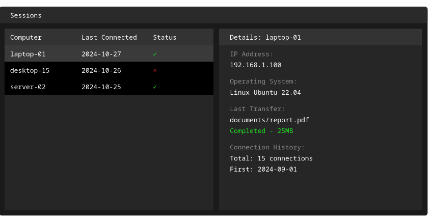

# Zync File Sharing


<!-- Alternative Methods -->

<!-- Method 1: Direct SVG embedding -->
<div align="center">
<svg viewBox="0 0 240 120" xmlns="http://www.w3.org/2000/svg">
  <!-- Gradient definitions -->
  <defs>
    <linearGradient id="leftArrowGrad" x1="0%" y1="0%" x2="100%" y2="100%">
      <stop offset="0%" style="stop-color:#4CAF50"/>
      <stop offset="100%" style="stop-color:#45a049"/>
    </linearGradient>
    <linearGradient id="rightArrowGrad" x1="0%" y1="0%" x2="100%" y2="100%">
      <stop offset="0%" style="stop-color:#2196F3"/>
      <stop offset="100%" style="stop-color:#1976D2"/>
    </linearGradient>
  </defs>

  <g transform="translate(120,60) rotate(0)">
    <path d="M-35 -8 L-15 -8 L-15 -16 L5 0 L-15 16 L-15 8 L-35 8 Z" 
          fill="url(#leftArrowGrad)"
          filter="drop-shadow(0 0 3px rgba(76,175,80,0.3))">
      <animate attributeName="opacity" 
               values="0.8;1;0.8" 
               dur="2s" 
               repeatCount="indefinite"/>
    </path>
    
    <path d="M35 8 L15 8 L15 16 L-5 0 L15 -16 L15 -8 L35 -8 Z" 
          fill="url(#rightArrowGrad)"
          filter="drop-shadow(0 0 3px rgba(33,150,243,0.3))">
      <animate attributeName="opacity" 
               values="1;0.8;1" 
               dur="2s" 
               repeatCount="indefinite"/>
    </path>
  </g>

  <rect x="115" y="58" width="10" height="2.5" fill="#2d2d2d">
    <animate attributeName="opacity"
             values="1;0.3;1" 
             dur="1.8s"
             repeatCount="indefinite"
             keySplines="0.4 0 0.6 1; 0.4 0 0.6 1"
             calcMode="spline"/>
  </rect>
  
  <text x="120" y="100" 
        font-family="monospace" 
        font-size="26" 
        font-weight="bold" 
        text-anchor="middle" 
        fill="#2d2d2d"
        filter="drop-shadow(0 1px 1px rgba(0,0,0,0.1))">
    zync
  </text>
</svg>
</div>

<!-- Method 2: Using img tag with width specification -->
<div align="center">
  
</div>

<!-- Method 3: Using HTML picture tag for better control -->
<div align="center">
  <picture>
    <source srcset="media/zync-logo-borderless.svg" type="image/svg+xml">
    
  </picture>
</div>

## Project Structure
```
your-project/
├── docs/
│   └── README.md
└── assets/
    ├── logo.svg
    └── logo.png
```
