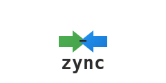

# Zync File Sharing

<div align="center">
  
</div>

## Project Structure
```
your-project/
├── docs/
│   └── README.md
└── media/
    ├── zync-logo-borderless.svg
    └── zync-logo-borderless.png
```
